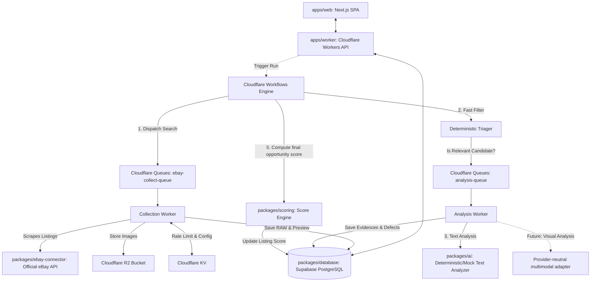

# Architecture Specification — Project Scout

This document details the architectural design for the **Opportunity Intelligence Platform (Project Scout)**. The active MVP boundary is DOCX v1.1 F0–F3: a staged, multi-source opportunity intelligence engine that reuses the existing eBay implementation.

---

## 1. Core Architectural Paradigm

Project Scout follows a **decoupled, event-driven, serverless-first monorepo architecture** built on top of TypeScript workspaces (`apps/` and `packages/`). The system separates the high-volume, potentially brittle ingestion processes from the high-cost, stateful AI analysis processes, and isolates both from the user-facing web interface.



---

## 2. Infrastructure & Monorepo Codebase Layout

### 2.1 Directory Layout

- `apps/web`: Next.js SPA Frontend Dashboard.
- `apps/worker`: Cloudflare Workers API Gateway & async Queue Consumers.
- `packages/domain`: Pure vendor-agnostic domain models, value objects, and ports interfaces.
- `packages/database`: PostgreSQL/Supabase queries, migrations, and typed database models.
- `packages/ebay-connector`: Official eBay Browse API adapter and payload mappers.
- `packages/ml-connector`: Official Mercado Livre BR API adapter, schemas and fixtures.
- `packages/xianyu-connector`: Xianyu fixture-first boundary and unavailable live mode.
- `packages/collection`: `CollectionGateway` orchestration and caching logic.
- `packages/search-intelligence`: Query families, cheap screening, identity and investigation states.
- `packages/valuation`: Versioned valuation, liquidity and seller-pressure engine.
- `packages/ai`: Prompts, LLM JSON extractors, and mock AI implementations.
- `packages/scoring`: Parametric opportunity score engine.
- `packages/schemas`: Shared Zod validation schemas.
- `packages/exports`: Spreadsheet formatting utilities (CSV/XLSX).
- `packages/config`: Shared TypeScript, ESLint, and environment configurations.

### 2.2 Web UI (`apps/web`)

- **Hosting**: Proposed serverless hosting (e.g. Vercel or Cloudflare Pages) pending user selection.
- **Role**: Serves as a Single Page Application (SPA) for the user. It communicates exclusively with the API Gateway via JSON REST endpoints.
- **Authentication**: Interfaced with Supabase Auth (OAuth / Email-Password) on the client side, passing JWT tokens in request headers to the API Gateway.
- **State Management**: React Query (TanStack Query) to manage cache and real-time dashboard updates.

### 2.3 API Gateway & Queue Consumers (`apps/worker`)

- **Role**: Acts as the central gateway for all frontend requests. It handles authentication validation (verifying Supabase JWTs), CRUD operations for projects, triggering collection jobs, and fetching analyzed results.
- **Routing**: Lightweight router (e.g., `Hono` or vanilla TypeScript router) running on edge nodes.
- **Database Connection**: Direct connections to Supabase PostgreSQL using connection pooling (via Supabase pooling URLs) or the Supabase PostgREST API client.

### 2.4 Async Processing Engine (Cloudflare Workflows & Queues)

- **Cloudflare Workflows**: Manages the step-by-step state of a "Collection Run". It coordinates the search dispatcher, awaits queue completion, triggers deduplication, routes candidates to analysis, and executes the scoring engine.
- **Cloudflare Queues**:
  - `ebay-collect-queue`: Buffers collection requests. Workers fetch pages concurrently while respecting target rate-limits. (Será renomeado/generalizado para `collect-queue` em T3 para múltiplas fontes.)
  - `analysis-queue`: Locally buffers minimal text-analysis run IDs. Consumers reload canonical listing text from PostgreSQL; multimodal tasks remain unimplemented.
- **Cloudflare KV**: Restrained exclusively to operational configuration data:
  - **Feature Flags**: Dynamic flags to enable/disable scrapers or adjust log levels.
  - **Rate Limiting**: Sliding-window rate limit trackers for eBay API target queries.
  - **Config Cache**: Short-lived cached values of public configurations (like external exchange rate caches, but **never** listing descriptions, HTML, or raw database entities).
- **Redis + BullMQ (plano pós-MVP)**: reservado para o plano real-time (F5 leilões live, F7 Local Agent). No MVP F0–F3, todo enqueue/dequeue roda em Cloudflare Queues. Ver `docs/post-mvp-roadmap.md`.

### 2.5 Ingestão multi-camada (DOCX §3)

A `CollectionGateway` escolhe a camada de ingestão por prioridade para cada fonte. Não existe "scraper único" — a melhor fonte legítima disponível é preferida. Ordem de prioridade:

1. **API oficial / webhook** — estável, estruturado, barato e previsível.
2. **Endpoint JSON / GraphQL** usado pelo frontend da fonte — dezenas de cards por chamada sem browser.
3. **WebSocket / SSE / long polling** — para lances, mudanças em tempo real e páginas vivas (uso pleno em F5).
4. **HTTP/HTML direto** — quando os dados vêm no HTML, sem exigir browser.
5. **Browser Playwright** — quando JS, sessão, interação ou renderização são necessários. No MVP, via Cloudflare Browser Rendering.
6. **DOM / MutationObserver** — fallback para páginas dinâmicas sem fonte estruturada reaproveitável.
7. **Screenshot + OCR/IA multimodal** — última camada, usada só quando o dado só é confiável visualmente.

Cada connector (`EbayApiAdapter`, `MercadoLivreApiAdapter`, `XianyuConnector`) declara sua camada primária e fallback. Trocar de camada durante execução é esperado (fases F4 self-healing exploram isso), não exceção.

### 2.6 Funil de triagem e enriquecimento progressivo (DOCX §5)

A economia do sistema: gastar informação na ordem correta. Não baixar 12 imagens e chamar IA multimodal para um anúncio cujo título já diz "somente caixa". O pipeline implementa camadas etiquetadas:

| Camada            | Trabalho                                                 | Custo                   |
| ----------------- | -------------------------------------------------------- | ----------------------- |
| 0 - Descoberta    | ID, título, preço, URL, miniatura, vendedor, local       | Muito baixo             |
| 1 - Filtro barato | Relevância, preço-isca, categoria errada, duplicata      | Baixo                   |
| 2 - Detalhe       | Descrição, condição, frete, vendedor, atributos          | Baixo/médio             |
| 3 - Mídia         | Baixar imagens somente dos candidatos                    | Médio                   |
| 4 - IA multimodal | Produto real, condição, incoerências, sinais de risco    | Médio/alto              |
| 5 - Investigação  | Mercado atual, liquidez, histórico, leilão, documentação | Alto; apenas finalistas |

Meta nominal: 1000 cards → 500 relevantes → 150 candidatos → 75 plausíveis → 25 fortes → Top oportunidades. `collector_health` mede completude e custo por camada; circuit breakers evitam tempestade de retries em qualquer camada.

### 2.7 Persistent Storage (Supabase & Cloudflare R2)

- **Supabase (`packages/database`)**:
  - **Relational DB**: Houses normalized listings, projects, sellers, evidence records, and defects.
  - **pgvector & Embeddings Scope**: Full RAG and pgvector vector storage are **not implemented in the initial state or Milestone 1**. The relational database schema is prepared to support future vector extensions, but embeddings will only be introduced if a concrete, approved use case emerges during later MVP phases and is formally documented in an ADR.
  - **RLS (Row Level Security)**: Restricts data access strictly to the owner of the `research_project` or `user_id`.
- **Cloudflare R2**:
  - **Raw Store (Milestone 6)**: Canonical raw eBay records are SHA-256-addressed in `RAW_BUCKET`; PostgreSQL retains the object key, hash and schema version.
  - **Image Store (Milestone 8)**: Milestone 6 persists image URL metadata only. Downloading and hashing image binaries into `IMAGE_BUCKET` remains deliberately deferred.

---

## 3. Decoupled Ingestion & Processing Pipeline

> **ATUALIZADO para DOCX v1.1** (seções 2.5 e 2.6 acima descrevem ingestão multi-camada e funil progressivo). O pipeline abaixo preserva o fluxo eBay implementado nos Milestones 1–7, enquanto `docs/mvp-plan.md` define sua generalização incremental para F0–F3 e três fontes. Em caso de conflito, `docs/mvp-plan.md` vence.

The pipeline is split into granular stages to enforce boundaries, control API costs, and guarantee resilience:

```
[User Project Search]
        │
        ▼
 1. Query Interpretation ──► Interprets prompt into a structured Query Schema (Zod) using cheap LLM.
        │
        ▼
 2. Collection Run ───────► Dispatches async tasks to eBay connector via Collection Gateway.
        │
        ├─► [packages/ebay-connector] ──► Reads listing details via official APIs or fallback.
        ├─► [Raw Store] ────────────────► Saves raw data payload and metadata path to PostgreSQL.
        └─► [Image Ingestion] ──────────► Downloads listing images, hashes them, and uploads to R2.
        │
        ▼
 3. Normalization ────────► Maps vendor-specific data (eBay format) into universal domain model.
        │
        ▼
 4. Deduplication ────────► Matches URL, external ID, and image hashes to identify duplicates (stored in DB).
        │
        ▼
 5. Deterministic Triage ─► Runs fast regex and price-sanity checks. Irrelevant items are marked.
        │
        ├─► [Irrelevant Listing] ──► Retained in DB with low score, skips expensive AI steps.
        └─► [Qualified Candidate] ─► Pushed to analysis-queue.
        │
        ▼
 6. Textual Analysis ─────► Deterministic/mock analyzer extracts declared defects and functional statements.
        │
        ▼
 7. Visual Analysis ──────► Multimodal Gemini processes R2 images to detect visual cracks, anomalies.
        │
        ▼
 8. Evidence Matching ────► Correlates text extracts and visual detections into Evidence models.
        │
        ▼
 9. Scoring Engine ───────► Calculates final opportunity, technical risk, fraud, and match scores.
        │
        ▼
[User Dashboard / REST API]
```

### Detailed Pipeline Cost-Control Strategy

1. **DB Dup Check**: Before executing any crawling step, the Collection Gateway checks the PostgreSQL database for existing listings by their external eBay ID. If present and updated recently, it skips refetching to save API rate-limits.
2. **First-Pass Filtration (Triage)**: Over 60% of collected listings can typically be discarded because they exceed the budget, belong to wrong categories, or are unrelated accessories. A fast, programmatic filter runs on the edge worker before any LLM is invoked.
3. **Cheap Textual LLM**: Listings that pass triage are sent to a fast, cost-efficient model (e.g., `gemini-2.5-flash`) for text analysis (description and attributes) to extract components and condition text.
4. **Multimodal LLM on Demand**: The visual analysis step (`gemini-2.5-pro` or multimodal `flash`) is only triggered for items that rank high on textual alignment. If text analysis indicates "pristine condition, above market price", visual analysis is skipped since it won't become an opportunity.

---

## 4. Interfaces and System Boundaries

To keep the codebase independent of external services (like specific scraping tools or LLM APIs), all key components interact via strict TypeScript interfaces declared inside `packages/domain`.

### 4.1 Collection Layer Interfaces

Exported by `packages/domain`; concrete orchestration is in `packages/collection`.

```typescript
export type JsonPrimitive = string | number | boolean | null;
export type JsonValue = JsonPrimitive | JsonValue[] | { [key: string]: JsonValue };
export type JsonObject = { [key: string]: JsonValue };

export interface FetchPageInput {
  url: string;
  useProxy?: boolean;
  jsRendering?: boolean;
  cacheTtlSeconds?: number;
}

export interface RawPage {
  content: string;
  statusCode: number;
  url: string;
  fetchedAt: Date;
}

export interface ScrapingProvider {
  fetchPage(input: FetchPageInput): Promise<RawPage>;
  extractStructured<T>(url: string, schema: JsonObject): Promise<T>;
}

export interface ListingPreview {
  externalId: string;
  url: string;
  title: string;
  price: { amountMinor: number; currency: string };
  imageUrl?: string;
  sellerExternalId?: string;
}

export interface SourceConnector {
  readonly source: 'ebay';
  readonly provider: string;
  search(input: ConnectorSearchInput): Promise<ConnectorSearchPage>;
  fetchDetails(externalId: string): Promise<RawListingRecord>;
}
```

Milestones 4–7 implement `DefaultCollectionGateway`, eBay connectors, normalization/ingestion and a separate textual-analysis queue. Ingestion returns listing UUIDs; a scheduler creates hash-idempotent analysis runs and publishes only run IDs. The consumer reloads bounded text, applies deterministic/mock analysis and transactionally persists evidence and defects. A live LLM remains disabled.

### 4.2 Analysis Layer Interfaces

Located in the provider-neutral domain package and implemented by adapters in `packages/ai`.

```typescript
export interface TextAnalyzer {
  readonly provider: string;
  readonly model: string;
  readonly promptVersion: string;
  analyze(input: TextAnalysisInput): Promise<TextAnalysisResult>;
}
```

`TextAnalysisRunRepository` isolates persistence and lifecycle transitions. Visual analysis remains a Milestone 8 port and is not operational.

### 4.3 Storage Interfaces

Located under `packages/domain/src/ports/storage.ts`.

```typescript
export interface ImageStorageService {
  uploadFromUrl(imageUrl: string, path: string): Promise<{ storagePath: string; hash: string }>;
  getSignedUrl(path: string, expiresInSeconds?: number): Promise<string>;
  delete(path: string): Promise<void>;
}
```

---

## 5. Security & Isolation

- **Edge Isolation**: The Cloudflare Workers running API endpoints have zero direct write-access to key config variables unless authenticated.
- **RLS Policies**: Supabase PostgreSQL uses Row Level Security. Every query executed by the serverless backend passes the user's JWT context (`auth.uid()`), ensuring users (and agents running on their behalf) can never read or write another user's research data.
- **Collection privilege split**: user routes use the user JWT and narrow collection RPCs; only the asynchronous consumer receives `service_role`, which is required to claim and finalize system-owned executions.
- **Prompt Injection Defense**: Listings descriptions are treated as arbitrary user-generated input. The prompts passed to the analysis workers wrap this description in strict XML tags and enforce formatting instructions via JSON schemas, instructing the model to strictly isolate content analysis from instruction compliance.
- **eBay privacy ingress**: `GET|POST /webhooks/ebay/account-deletion` is the only unauthenticated eBay route. GET uses the configured exact URL/token challenge; POST verifies `x-ebay-signature` before publishing to a dedicated queue. The consumer removes R2 objects and then invokes service-role-only deletion RPCs. See [ebay-account-deletion.md](./ebay-account-deletion.md).
