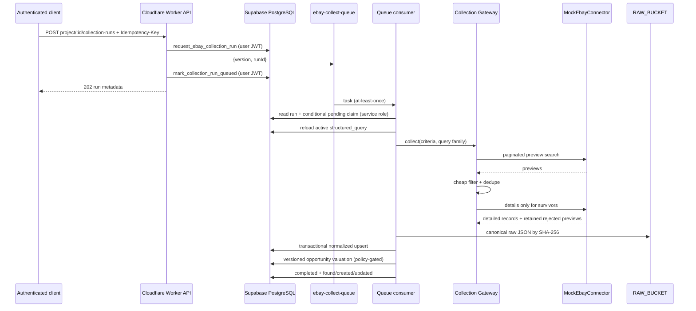

# Collection Gateway — Marco 4

## Implemented boundary

Marco 4 established asynchronous orchestration; Marcos 5–6 add the official adapter and normalized persistence. The queue consumer now collects, normalizes, writes raw R2 objects, transactionally upserts PostgreSQL records and reports created/updated counters. In F3, projects that declare `opportunityPolicy` also receive a deterministic, versioned valuation after persistence.

## Contracts

- `SourceConnector`: paginated raw search and detail lookup.
- `CollectionGateway`: orchestrates a connector, validates every response with shared Zod schemas, applies the generic cheap preview filter before detail calls, and retains rejected previews as preview-only records for triage.
- `ScrapingProvider`: future port only; no implementation exists.
- `CollectionRunRepository`: idempotent request/read, controlled queue lifecycle transitions and bounded request-position updates while a run is active.
- `CollectionTaskProcessor`: canonical criteria reload, execution, optional valuation and retry classification independent of Cloudflare APIs.

## Idempotency and failure handling

The API requires an `Idempotency-Key` containing 8–128 safe characters. PostgreSQL makes it unique per project. Retrying a request with the same key returns the existing run and does not publish again once `queued_at` exists.

Text analysis is downstream of persisted collection data. If its queue is unavailable after ingestion, the collection remains `completed`; the analysis stays eligible for explicit replay and the marketplace is never recollected for that secondary failure. The isolated production Wrangler configuration declares the analysis producer, consumer and DLQ, but provisioning and deployment remain explicit operational gates.

Cloudflare Queues deliver at least once, so the consumer first reads the run and then performs a conditional claim by `status=pending` and the expected `attempt_count`; the filtered update is atomic at the database statement boundary. A running lease lasts five minutes. A redelivery that finds the lease active, absent, or expired on its first delivery is retried after 30 seconds; only an expired lease together with `Message.attempts > 1` is classified as `COLLECTION_RUN_ORPHANED`, acknowledged, and never recollected. Explicit transient connector failures use exponential delay capped at 60 seconds and stop after three execution attempts. A transient failure after the gateway has returned results is terminal and preserves its causal code. Permanent failures never retry. Unexpected infrastructure failures ask Cloudflare to retry the message and do not expose payloads or secrets in logs. The local consumer permits 12 delivery retries so a transient post-claim outage can outlive the lease. Collection and analysis consumers now route exhausted messages to configured DLQs; the collection DLQ still needs an operational alert and reviewed replay/retention procedure before remote deployment. The account-deletion queue deliberately remains without a DLQ until its privacy-retention policy covers failed payloads containing transient eBay identifiers. Query families are capped at three queries per run, split across the run limit, and deduplicate external IDs before another detail call. Rejected previews are ingested with `previewOnly=true` so their triage decision remains visible without paying for details. In eBay Production, the local gateway derives the detail budget from the explicit per-run Browse budget.

## Mock fixtures

`MockEbayConnector` returns five eBay-only raw examples covering a cracked powered-on phone, untested parts item, Activation Lock, contradictory no-power description and insufficient evidence. URLs and image URLs are metadata only; they are never fetched. Failure injection is available only to tests.

## API

- `POST /api/projects/:projectId/collection-runs` — active owned project and mandatory `Idempotency-Key`; returns `202` when newly queued and `200` for an existing run.
- `GET /api/projects/:projectId/collection-runs/:runId` — owner-scoped status lookup; inaccessible/nonexistent runs return `404` through RLS.

## Normalization and persistence

`ListingIngestionService` maps each validated raw item, stores canonical JSON in `RAW_BUCKET`, and invokes `ingest_normalized_ebay_listing`. External ID protects identity; raw hash protects redelivery/snapshot idempotency. A raw-storage or database outage is transient and retried; invalid normalization is permanent.

## F3 boundary

Valuation is a recommendation only. The processor uses current records from the
same bounded collection result as comparables, persists missing evidence instead
of fabricating history, and never places bids, sends messages or executes a
purchase. `GET /api/projects/:projectId/listings/:listingId/valuation` returns
the latest valuation only after authenticated project/listing ownership checks.

## Deferred to later milestones

Mock remains the default. Cross-ID visual duplicate clustering, image binary ingestion, remote Cloudflare provisioning and Production catalog validation remain deferred. Rich historical valuation, persisted triage decisions and live non-eBay sources remain future gates.
