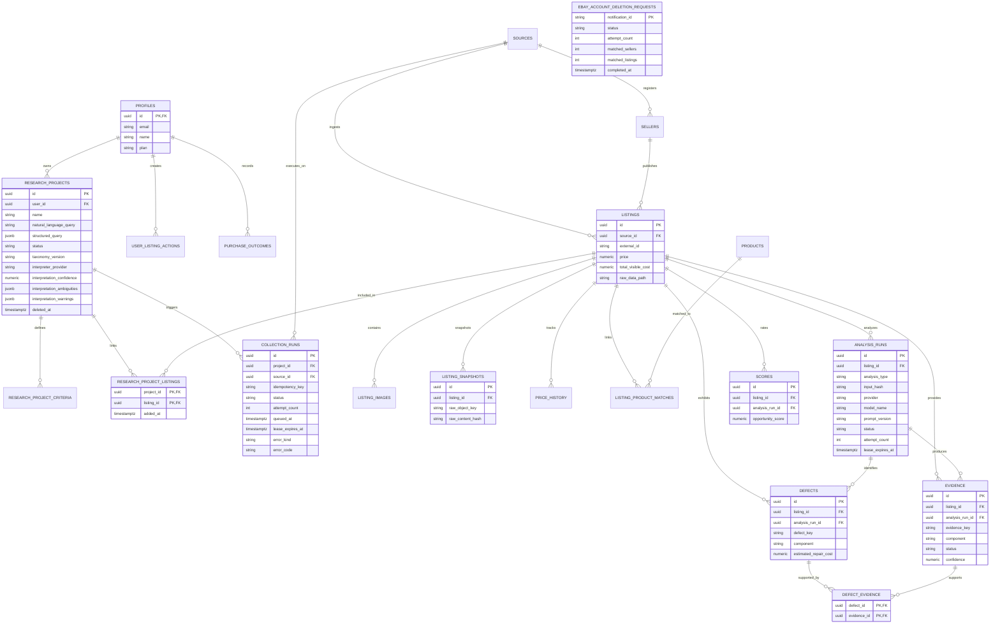

# Database Schema Specification — Project Scout

This document details the relational database schema implemented in **PostgreSQL / Supabase** for **Project Scout** through Milestone 7.

---

## 1. Entity-Relationship Diagram (Mermaid ER)

---

## 2. Table Specifications

1. `profiles`: System users mapped to `auth.users` via Foreign Key `profiles.id REFERENCES auth.users(id)`.
2. `sources`: Marketplace platforms (specifically eBay).
3. `research_projects`: User search initiatives, original query, structured criteria and versioned interpretation metadata. Lifecycle is `draft`, `active`, `archived` or `deleted`; default reads hide soft-deleted records.
4. `research_project_criteria`: Parametric filters (accepted/rejected defects, max price in BRL).
5. `research_project_listings`: Junction table connecting search projects to listings.
6. `sellers`: Marketplace vendor profiles.
7. `listings`: Normalized listing entries.
8. `listing_images`: Image URLs and R2 storage paths.
9. `listing_snapshots`: Audit snapshot history with `raw_object_key` and `raw_content_hash`.
10. `price_history`: Price movement history.
11. `collection_runs`: Idempotent, owner-visible collection executions. `(project_id, idempotency_key)` is unique; lifecycle timestamps, retry lease/attempt count and classified failure metadata are queryable columns.
12. `products`: Canonical product catalog.
13. `listing_product_matches`: Product catalog linkage.
14. `analysis_runs`: Versioned text-analysis lifecycle, input hash, provider/model, lease, attempts, usage and safe failure metadata.
15. `evidence`: Extracted facts, inferences, and unknown claims linked to an analysis run by a local evidence key.
16. `defects`: Declared/inferred defects linked to an analysis run and relational supporting evidence.
17. `defect_evidence`: Junction table supporting defect claims with evidence references.
18. `scores`: Score history records with dedicated UUID primary key and `analysis_run_id` reference.
19. `opportunity_valuations`: Versioned F3 market valuation, maximum purchase price, deal/trend/liquidity/seller-pressure scores, confidence, evidence and missing-data explanations.
20. `user_listing_actions`: User favorites, decisions (`approved`, `rejected`), and notes.
21. `purchase_outcomes`: Post-purchase feedback tracking ROI.
22. `ebay_account_deletion_requests`: Service-only minimal audit for idempotent eBay privacy deletion; it stores no eBay account identifier.

## 3. Incremental migration history

- `20260728160000_initial_schema.sql`: Marco 2 relational foundation and RLS.
- `20260728190000_milestone3_research_intent.sql`: project lifecycle, interpreter/schema/taxonomy versions, confidence, ambiguity/warning arrays, soft-delete timestamp and owner/status/updated index.
- `20260728210000_milestone4_collection_runs.sql`: idempotency key, queue/lease/retry/error metadata, state consistency check and atomic service-role claim.
- `20260728213000_milestone4_collection_security.sql`: revokes direct authenticated lifecycle mutation and exposes only owner-checked request/queued RPCs.
- `20260729120000_milestone6_ingestion.sql`: service-role-only transactional normalized ingestion, raw-hash lookup index and per-listing image URL uniqueness.
- `20260729172535_milestone6_1_ebay_account_deletion.sql`: private deletion audit plus service-role-only preparation/finalization RPCs.

Milestone 5 requires no schema migration. The existing `collection_runs.provider` column records the adapter selected by the trusted consumer.

`ingest_normalized_ebay_listing` converts integer minor-unit money to `NUMERIC(12, 2)`, upserts the seller/listing, links the listing to the project, upserts image URL metadata, appends a snapshot only for new/changed raw hashes, and appends price history only when price, shipping or status changes. Execution is granted exclusively to `service_role`.

`structured_query` is canonical for the interactive criteria document in Marco 3. `research_project_criteria` remains a compatibility table and is not dual-written.
