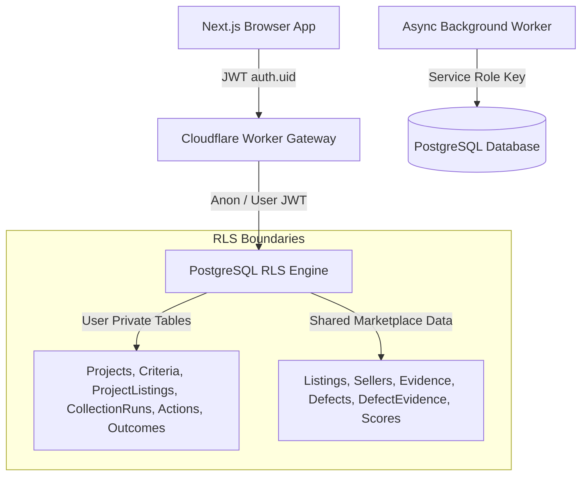

# Database Security & RLS Architecture — Project Scout

This document specifies the security rules, PostgreSQL grants, Row Level Security (RLS) policies, and token privilege boundaries enforced in PostgreSQL / Supabase for **Project Scout**.

---

## 1. Security Architecture Overview

Project Scout enforces security at the PostgreSQL database level through **Principle of Least Privilege SQL Grants** combined with **Row Level Security (RLS)**.

For user requests, the browser signs in with Supabase Auth and sends the access token to the Worker. The Worker verifies `/auth/v1/user`, derives the owner UUID, and forwards the same bearer token plus the public anon key to PostgREST. It never accepts a client `userId` and never loads `service_role` for project or collection-request routes.

On first authenticated use, the Worker upserts only `{id, email}` into `profiles` with the user's own JWT; the profile owner policy constrains that write. A project hidden by RLS is reported as 404, matching a nonexistent project.

---

## 2. Role Privilege Matrix (Least Privilege Principles)

| Table Group                                                                                                                                                                                                                           | Role `anon`   | Role `authenticated`                                                                | Role `service_role`                          |
| :------------------------------------------------------------------------------------------------------------------------------------------------------------------------------------------------------------------------------------ | :------------ | :---------------------------------------------------------------------------------- | :------------------------------------------- |
| **Private User Data** (excluding `collection_runs`)                                                                                                                                                                                | **NO ACCESS** | `SELECT`, `INSERT`, `UPDATE`, `DELETE` _(Strictly scoped by RLS owner policies)_ | `ALL`                                        |
| **`collection_runs`**                                                                                                                                                                                                                 | **NO ACCESS** | Owner-scoped `SELECT`; lifecycle writes only through the two narrow RPCs            | `ALL`; claim RPC reserved to queue consumers |
| **Shared Marketplace Data** (`sources`, `sellers`, `listings`, `listing_images`, `listing_snapshots`, `price_history`, `products`, `listing_product_matches`, `analysis_runs`, `evidence`, `defects`, `defect_evidence`, `scores`) | **NO ACCESS** | `SELECT` _(No write access for end users)_                                       | `ALL` _(Ingestion & background queues)_   |
| **Opportunity valuations**                                                                                                                                                                                                            | **NO ACCESS** | `SELECT` _(only through an owned project/listing link)_                          | `ALL` _(queue consumer only)_             |

---

## 3. Row Level Security (RLS) Policies

### 3.1 Private User Data & Project Scope Tables

Access is strictly restricted via both `USING` and `WITH CHECK` clauses:

1. **`profiles`**: `USING (auth.uid() = id) WITH CHECK (auth.uid() = id)`
2. **`research_projects`**: `USING (auth.uid() = user_id) WITH CHECK (auth.uid() = user_id)`
3. **`research_project_criteria`**: `USING (EXISTS (SELECT 1 FROM research_projects rp WHERE rp.id = project_id AND rp.user_id = auth.uid())) WITH CHECK (EXISTS (SELECT 1 FROM research_projects rp WHERE rp.id = project_id AND rp.user_id = auth.uid()))`
4. **`research_project_listings`**: `USING (EXISTS (SELECT 1 FROM research_projects rp WHERE rp.id = project_id AND rp.user_id = auth.uid())) WITH CHECK (EXISTS (SELECT 1 FROM research_projects rp WHERE rp.id = project_id AND rp.user_id = auth.uid()))`
5. **`collection_runs`**: `USING (EXISTS (SELECT 1 FROM research_projects rp WHERE rp.id = project_id AND rp.user_id = auth.uid())) WITH CHECK (EXISTS (SELECT 1 FROM research_projects rp WHERE rp.id = project_id AND rp.user_id = auth.uid()))`
6. **`user_listing_actions`**:
   `USING (auth.uid() = user_id AND EXISTS (SELECT 1 FROM research_projects rp WHERE rp.id = project_id AND rp.user_id = auth.uid()) AND EXISTS (SELECT 1 FROM research_project_listings rpl WHERE rpl.project_id = project_id AND rpl.listing_id = listing_id))`
   `WITH CHECK (auth.uid() = user_id AND EXISTS (SELECT 1 FROM research_projects rp WHERE rp.id = project_id AND rp.user_id = auth.uid()) AND EXISTS (SELECT 1 FROM research_project_listings rpl WHERE rpl.project_id = project_id AND rpl.listing_id = listing_id))`
7. **`purchase_outcomes`**: `USING (auth.uid() = user_id) WITH CHECK (auth.uid() = user_id)`
8. **`opportunity_valuations`**: `SELECT` only when the valuation listing belongs to a
   non-deleted project owned by `auth.uid()` through `research_project_listings`.

### 3.2 Collection execution functions

- `request_ebay_collection_run(project_id, idempotency_key)` is executable only by `authenticated`. It verifies `auth.uid()`, requires an active owned project, resolves the configured eBay source server-side and always fixes provider to `ebay-mock-v1`.
- `mark_collection_run_queued(run_id)` is executable only by `authenticated`; it can only stamp an owned pending run.
- `claim_collection_run(run_id)` is executable only by `service_role`. It atomically claims pending/expired work and prevents concurrent duplicate processing.
- Every function is `SECURITY DEFINER` with a fixed `search_path`, explicit grants and no caller-controlled dynamic SQL.

Milestone 5 adds no table, policy, function or grant. After a service-role-only claim, the trusted queue consumer updates `collection_runs.provider` to the selected mock/Sandbox/Production adapter. Authenticated users still cannot mutate that lifecycle metadata directly.

### 3.3 Normalized ingestion function

`ingest_normalized_ebay_listing` is executable only by `service_role`; `PUBLIC`, `anon` and `authenticated` are explicitly revoked. It accepts validated normalized JSON plus R2 key/hash metadata and performs all shared-data writes transactionally. A live integration test confirms authenticated execution is denied. The function uses fixed `search_path` and no dynamic SQL.

### 3.4 Shared Marketplace Data Tables

Marketplace listings, sellers, AI analysis, evidence, defects, defect_evidence, and scores are global shared data:

Milestone 7 keeps authenticated access read-only. `request_text_analysis`, queue marking, atomic claim, completion, retry and failure RPCs revoke `PUBLIC`, `anon` and `authenticated` execution and grant only `service_role`. Every security-definer function fixes `search_path`; completion resolves defect evidence only inside the claimed run. The service key is used only by the queue consumer.

- **Read Access (`SELECT`)**: Granted to any authenticated user (`TO authenticated USING (true)`).
- **Write Access (`INSERT`, `UPDATE`, `DELETE`)**: Strictly restricted to the background worker using the `service_role` key (`TO service_role USING (true)`).

Opportunity valuations are an exception to the shared read rule: their rows are
written only by the queue consumer, but authenticated reads are filtered through
the owning project/listing junction. The API also checks the requested project
before returning the latest row.

### 3.5 eBay account deletion

`ebay_account_deletion_requests` has RLS enabled and no user policy. `PUBLIC`, `anon` and
`authenticated` have neither table access nor RPC execution. Only the deletion queue consumer
uses `service_role` for `prepare_ebay_account_deletion` and `finalize_ebay_account_deletion`.
Both functions use a fixed `search_path` and no dynamic SQL. The audit table intentionally omits
`username`, `userId` and `eiasToken`.
